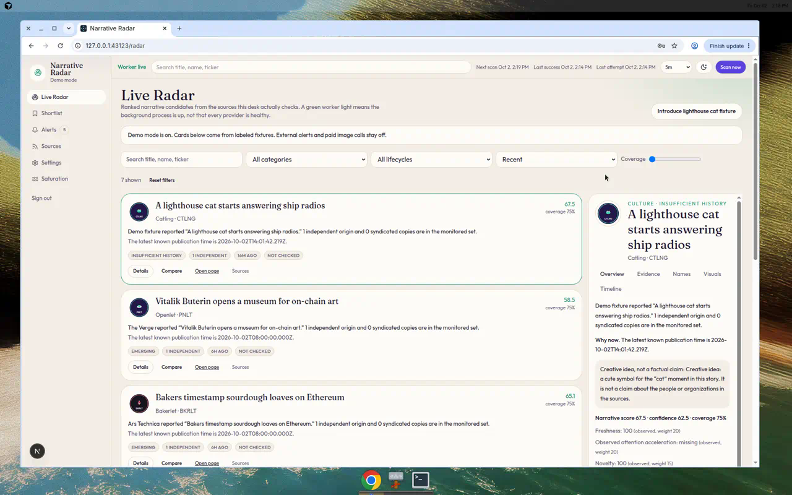
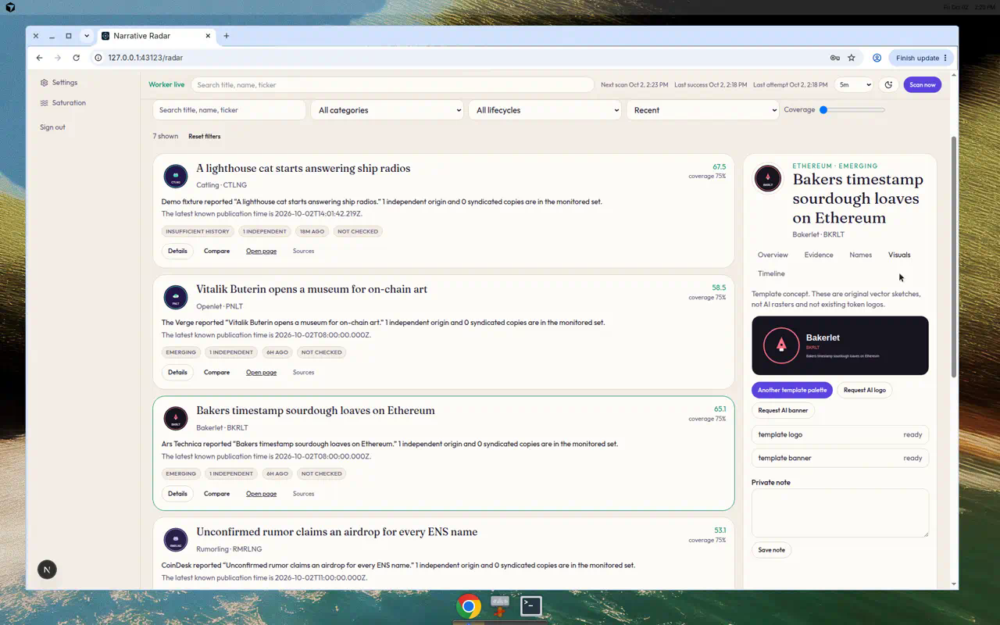
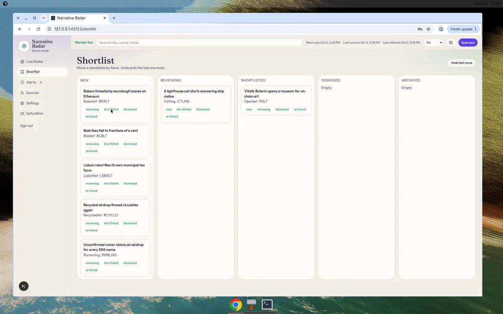

# Narrative Radar

A private research desk for emerging token narrative ideas. It reads monitored sources, keeps one card per event, explains a narrative score, and sketches a name, ticker, logo, and banner. Scores are signals and creative fit. They are not expected returns, and this app does not deploy or trade tokens.

The desk starts in **demo mode** with labeled fixtures so you can use it before any API key exists. Live mode adds RSS and Hacker News. X, OpenAI, and Telegram stay visibly unconfigured until you add credentials.

## Run with Docker Desktop (Windows)

1. Install Docker Desktop and start it.
2. Copy `.env.example` to `.env`.
3. Set `AUTH_SECRET` to a long random string and `OWNER_PASSWORD` to a password you will remember.
4. In a terminal opened in this folder:

```powershell
docker compose up --build
```

5. Open http://localhost:43123 and sign in with `OWNER_EMAIL` and `OWNER_PASSWORD`.
6. Shut it down with `docker compose down`. Add `-v` only if you also want to delete the database volume.

The web container migrates and seeds on startup. The worker container keeps scanning after you close the browser. Both stop when Docker stops. That is expected on a laptop.

## Run locally without Docker

Requirements: Node.js 22, pnpm, PostgreSQL 16, Redis.

```bash
cp .env.example .env
# fill AUTH_SECRET and OWNER_PASSWORD, then copy .env to apps/web, apps/worker, and packages/db
pnpm install
pnpm db:migrate
pnpm db:seed
pnpm dev
```

`pnpm dev` starts the site on http://127.0.0.1:43123 and the worker beside it.

## Deploy the web app on Netlify

Netlify builds the Next.js app. It does not run the worker or Redis. **Scan now** still works. A schedule runs only if you also host the worker.

1. Create a hosted Postgres database and copy its connection string.
2. In Netlify, set these environment variables for both build and runtime:
   - `DATABASE_URL`
   - `AUTH_SECRET` (a long random string)
   - `AUTH_URL` (the site's https origin, such as `https://your-site.netlify.app`)
   - `OWNER_EMAIL`
   - `OWNER_PASSWORD`
   - `DEMO_SHOW_LOGIN_HINT` = `false`
3. Deploy this repository. `netlify.toml` builds with `pnpm --filter @radar/web... run build` and the Next.js plugin.
4. The build generates Prisma Client, and when `DATABASE_URL` is set it migrates and seeds the owner.

Leave `DATABASE_URL` empty only to confirm the compile. The signed-in desk needs Postgres.

Other commands:

```bash
pnpm test
pnpm --filter @radar/web lint
pnpm typecheck
pnpm build
pnpm start
pnpm worker
```

`pnpm db:push` is a shortcut that matches the schema without the migration history. Prefer `pnpm db:migrate` (`prisma migrate deploy`) on a new database.

## Screenshots

Captured from the running desk in demo mode.







## What you can do

- **Live Radar** ranks candidates and lets you open evidence without leaving the list.
- **Shortlist** moves a card between New, Reviewing, Shortlisted, Dismissed, and Archived.
- **Alerts** is the inbox. Browser notifications work only while the tab is open. Telegram can deliver after that, once you pair your own bot.
- **Sources** shows each provider as connected, unconfigured, healthy, or in error, and accepts another feed URL or a pasted article.
- **Settings** stores the 1m / 5m / 15m / 1h schedule or a custom interval from 60 seconds to 24 hours.

Scan now, pause, and the interval are server-side. A failed scan does not erase the last success time.

## Keys

Leave optional variables blank until you have them. See `docs/PROVIDERS.md`.

- `OPENAI_API_KEY`, `OPENAI_TEXT_MODEL`, `OPENAI_IMAGE_MODEL`, `OPENAI_IMAGE_SIZE` — only values your account documents. No model id is guessed.
- `X_BEARER_TOKEN` — recent search for the access your X account actually has.
- `TELEGRAM_BOT_TOKEN` — then use Alerts to pair with a one-time code.

Demo mode does not send Telegram messages or call paid APIs.

## Tests already run

`pnpm test` — 26 tests. `pnpm --filter @radar/web build` succeeded. Details and the checks that still need your accounts are in `docs/ACCEPTANCE.md`.
